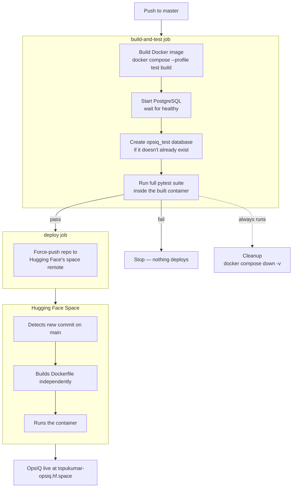

# OpsIQ — Intelligent Ops Assistant

An AI incident-analysis tool. Upload a production log and get a structured postmortem — errors, timeline, root cause, remediation plan — then ask follow-up questions grounded in the log itself.

**Regression-tested against three real production postmortems** (GitLab 2017, Cloudflare 2019, AWS us-east-1 2020). Each test runs the full pipeline on a synthetic log reconstructed from the published incident report and checks that the expected technical vocabulary appears in the output. Results are cached to disk, so the suite is reproducible without an API key.

Built with FastAPI, LangGraph, FAISS, and Postgres.

🔗 **[Live Demo](https://topukumar-opsiq.hf.space)**

---

## Validation

Three synthetic logs, each reconstructed from a published incident report, run through the full postmortem pipeline. The assertions are keyword-presence checks against the generated report — they catch a pipeline producing empty, generic, or off-topic output, but they do not score reasoning quality or verify that the model's causal explanation is correct.

| Incident | Actual root cause | What the tests check |
| -------- | ----------------- | -------------------- |
| **GitLab 2017** database deletion | Operator error — `rm -rf` on the primary DB | Report mentions human/operator error, the database component, a deletion event, and backup/restore in remediation |
| **Cloudflare 2019** global outage | ReDoS in a WAF regex rule → CPU exhaustion | Report mentions a resource/CPU term, a WAF or regex term, a deployment/change term, and rollback in remediation |
| **AWS 2020** us-east-1 outage | Kinesis thread exhaustion → cascading failure | Report mentions cascading failure, a thread/capacity term, at least two affected AWS services, extended duration, and capacity in remediation |

Cloudflare is the most demanding of the three: a regex backtracking bug starving CPU across a global network has to be inferred from the pattern of what failed and when, rather than read directly off the log.

```bash
cd backend && pytest tests/test_validation.py -v
```

Results are cached to disk, so the suite runs without a Groq key and without burning quota. Delete `tests/validation/cache/` to force a fresh run against the live API.

**What this is and isn't.** This is a regression suite: it will fail loudly if a prompt change, model swap, or pipeline refactor makes the reports stop covering the expected ground. It is not a semantic accuracy benchmark — passing means the right terms appeared, not that the analysis was correct. Judging that still requires reading the reports, which live in `tests/validation/cache/`.

---

## Tech Stack

| Layer            | Technology                            |
| ---------------- | ------------------------------------- |
| Backend          | FastAPI, Python 3.12                  |
| AI orchestration | LangGraph, LangChain                  |
| LLM              | Groq API                              |
| Embeddings       | HuggingFace all-MiniLM-L6-v2          |
| Vector store     | FAISS (persisted to disk per session) |
| Database         | PostgreSQL + SQLAlchemy async         |
| Auth             | HMAC-SHA256 signed cookies + bcrypt   |
| Rate limiting    | slowapi                               |
| Frontend         | HTML + vanilla JS (SSE streaming)     |
| CI/CD            | GitHub Actions → Hugging Face Spaces  |
| Deployment       | Docker (dev: Docker Compose)          |

---

## Features

### Three conversation modes

| Mode           | Trigger                 | What happens                                                            |
| -------------- | ------------------------ | ------------------------------------------------------------------------ |
| **Chat**       | Send a message          | Conversational Q&A with rolling memory summarisation                    |
| **RAG**        | Upload PDF / DOCX / TXT | Document ingested into FAISS, answers grounded in its content           |
| **Postmortem** | Upload `.log`           | Parallel LangGraph pipeline — errors, timeline, root cause, remediation |

### Postmortem pipeline

```
       ┌─────────────┐
       │  Log ingest │  chunk → extract errors → embed → FAISS
       └──────┬──────┘
              │
      ┌───────┴────────┐
      ▼                ▼
[log_analyzer]    [timeline]      ← run concurrently
      └───────┬────────┘
              ▼
        [root_cause]              ← fan-in: uses both outputs
              ▼
        [remediation]
              ▼
      [report_summarizer]         ← formats report, seeds pm_memory
```

`log_analyzer` and `timeline` have independent inputs, so LangGraph runs them in parallel. Each node issues its own FAISS query — errors and severity for one, timestamps and sequence for the other — rather than reusing a single retrieval.

### Session management

- Multiple independent sessions per user
- Write-through in-memory cache with Postgres as the source of truth
- Server restarts are transparent — sessions restore from Postgres + FAISS on disk
- Idle sessions evicted from memory after a TTL; the DB row and vectors remain for reconnection
- The report is persisted, so the panel survives a redeploy

### Memory

- Three separate memory objects per session (chat / RAG / postmortem) so modes don't pollute each other
- `ConversationSummaryBufferMemory` compresses older turns into a rolling summary
- Summary plus the last 20 raw messages persisted on every turn
- On reconnect the summary covers old context and the raw messages cover recent context
- Chat history carries into RAG memory when a file is uploaded mid-conversation

### Auth

- bcrypt password hashing (12 rounds)
- Stateless HMAC-SHA256 tokens in httponly cookies
- `token_version` in the signed payload, compared against the DB — logout invalidates every existing token rather than only clearing the local cookie
- Timing-safe signature comparison
- Login errors don't reveal whether the email or the password was wrong (there's a test asserting the two messages are byte-identical)

### Frontend

- Live token-by-token streaming over SSE
- Collapsible, resizable report panel
- Paginated message history
- Session restore on refresh
- Markdown rendering
- Responsive — sidebar collapses on mobile

---

## Setup

Docker is the supported path. It runs Postgres and the app together, so there's nothing to install locally beyond Docker itself.

### Prerequisites

- Docker and Docker Compose v2
- A Groq API key — [console.groq.com](https://console.groq.com)

### 1. Clone and configure

```bash
git clone https://github.com/topukumar538/OpsIQ-ai
cd OpsIQ-ai
cp .env.example .env
```

Edit `.env` and set the two required values:

```dotenv
GROQ_API_KEY=gsk_your_key_here
SECRET_KEY=
```

Generate a secret key:

```bash
python3 -c "import secrets; print(secrets.token_hex(32))"
```

The app refuses to start with an empty, short, or placeholder-looking `SECRET_KEY` — the error message prints a freshly generated one you can paste in.

Check [Groq's model list](https://console.groq.com/docs/models) and set `MODEL_NAME` to a model your key can access. Availability and tiers change; a model that worked previously may move behind an enterprise plan.

### 2. Run

```bash
docker compose up --build
```

Open **http://localhost:8000**

First build takes a few minutes — it installs torch and bakes the embeddings model into the image so container starts don't depend on Hugging Face being reachable.

If port 8000 or 5432 is already in use on your machine, override them:

```bash
APP_PORT=8001 DB_PORT=5433 docker compose up --build
```

### 3. Stop

```bash
docker compose down       # keeps your data
docker compose down -v    # deletes the database and vector stores
```

### Running locally without Docker

Possible, but you'll need Postgres 15+ running yourself:

```bash
python -m venv venv && source venv/bin/activate
pip install -r requirements.txt
cd backend && uvicorn main:app --reload --workers 1
```

Set `DATABASE_URL` to your own instance and `DB_SSL=false`.

---

## Tests

```bash
cd backend
pytest tests/ -v
```

Six test files. `test_auth.py` needs Postgres and points at a separate `opsiq_test` database. In CI this database is created automatically as part of the pipeline (see [CI/CD](#cicd) below). Running the full suite locally for the first time, create it once:

```bash
docker compose up -d db
docker compose exec db psql -U opsiq -d opsiq -c "CREATE DATABASE opsiq_test"
```

The rest of the suite is unit tests with no external dependencies:

```bash
# no database needed
pytest tests/test_tokens.py tests/test_router.py tests/test_ingest.py tests/test_config.py -v

# needs Postgres (and opsiq_test, created above)
pytest tests/test_auth.py -v

# postmortem regression suite — runs from cache, no API key needed
pytest tests/test_validation.py -v
```

Or run the whole suite in a container against the same image the app uses:

```bash
docker compose --profile test build
docker compose up -d db
docker compose exec db psql -U opsiq -d opsiq -c "CREATE DATABASE opsiq_test"
docker compose --profile test run --rm tests
```

---

## CI/CD

Every push to `master` builds the app, runs the full test suite against a real Postgres, and — if everything passes — deploys to the Hugging Face Space. Defined in `.github/workflows/ci-cd.yml`.



**Why the image gets built twice.** CI builds the image and runs the tests inside it. Hugging Face then builds the same `Dockerfile` independently on its own infrastructure, and that build is what serves traffic. Both come from the same commit and `requirements.txt` is pinned, so the two builds should match — but they are separate builds, not the same image moved between machines.

**`opsiq_test` is created directly in the workflow**, not via a local init script — a check-then-create in bash (`SELECT ... WHERE datname='opsiq_test'`, then `CREATE DATABASE` if missing) runs after Postgres reports healthy, before tests start. This keeps CI self-contained with no extra files to keep in sync.

**Docs-only pushes skip CI.** `paths-ignore` covers `**.md`, `docs/**`, `.gitignore`, and `LICENSE`, so a README edit doesn't trigger a full build and deploy.

**Required GitHub secrets** (Settings → Secrets and variables → Actions):

| Secret | Purpose |
|---|---|
| `HF_TOKEN` | Hugging Face access token with write access to the Space |
| `HF_USERNAME` | Your HF username |
| `HF_SPACE_NAME` | The Space's repo name |
| `SECRET_KEY` *(optional)* | Falls back to a CI-only placeholder if unset |
| `GROQ_API_KEY` *(optional)* | Not required — `test_validation.py` runs from its disk cache |

Runtime secrets for the *live* app (`DATABASE_URL`, `SECRET_KEY`, `GROQ_API_KEY`, `MODEL_NAME`) are configured separately, directly in the Space's own **Settings → Variables and secrets** on huggingface.co. This workflow only pushes code — it never touches those, so changing a model or rotating a key in production is a manual step there.

**Run the same checks locally** before pushing:

```bash
docker compose --profile test build
docker compose --profile test run --rm tests
```

---

## Project Structure

```
OpsIQ-ai/
├── .github/
│   └── workflows/
│       └── ci-cd.yml            # build, test, deploy to Hugging Face on push to master
├── Dockerfile                   # at the root — Hugging Face Spaces requires it here
├── docker-compose.yml           # app + Postgres + test runner
├── requirements.txt
├── .env.example
├── backend/
│   ├── main.py                  # FastAPI app, routes, SSE streaming
│   ├── config.py                # Pydantic settings with validation
│   ├── session.py               # Write-through session cache + postmortem runner
│   ├── prompts.py               # Prompt templates for the three modes
│   ├── router.py                # File type classifier
│   ├── auth/
│   │   ├── models.py            # SQLAlchemy models (cascade deletes)
│   │   ├── router.py            # signup / login / logout / me
│   │   ├── tokens.py            # HMAC-SHA256 sign + verify
│   │   ├── dependencies.py      # auth dependency
│   │   └── database.py          # async engine + session factory
│   ├── graph/
│   │   └── state.py             # OpsState, mode constants, initial state
│   ├── postmortem/
│   │   ├── builder.py           # parallel pipeline graph
│   │   ├── ingest.py            # chunking, error extraction, FAISS build
│   │   ├── report.py            # report formatting
│   │   ├── state.py             # PostmortemState
│   │   └── nodes/               # 5 pipeline nodes
│   ├── rag/ingest.py            # PDF/DOCX/TXT → FAISS
│   ├── core/
│   │   ├── llm.py               # LLM factory (3 temperatures)
│   │   ├── memory.py            # memory helpers + DB persistence
│   │   ├── retriever.py         # FAISS similarity search
│   │   └── faiss_store.py       # disk persistence
│   └── tests/
│       ├── test_tokens.py       # HMAC token signing and tampering
│       ├── test_router.py       # file classifier
│       ├── test_ingest.py       # log parsing and error extraction
│       ├── test_config.py       # settings validation
│       ├── test_auth.py         # auth endpoints (needs Postgres)
│       └── test_validation.py   # postmortem regression vs real incidents
└── frontend/
    ├── index.html               # main app
    ├── login.html
    └── signup.html
```

---

## API

### Auth

```
POST /auth/signup       register  (5/min)
POST /auth/login        login     (10/min)
POST /auth/logout       invalidates all tokens for this user
GET  /auth/me           current user
```

### Sessions

```
POST   /session              create
GET    /sessions             list all for current user
DELETE /session              delete (DB row + FAISS files)
GET    /session/state        mode + report + first page of messages
GET    /session/mode         current mode
GET    /session/memory       memory summary + messages + report
GET    /session/messages     paginated history (?before=id&limit=20)
```

### Chat and upload

```
POST /chat              send a message      (20/min, 100/day)  SSE
POST /upload            upload a file       (3/min, 20/day)    SSE for .log
GET  /upload/extensions accepted types + size limit
```

Every streaming response is JSON-framed SSE:

```
data: {"event":"token",   "text":"..."}
data: {"event":"progress","text":"..."}
data: {"event":"report",  "text":"..."}
data: {"event":"error",   "text":"..."}
data: {"event":"done"}
```

Raw `data: <text>` framing breaks apart at every blank line in the model's markdown — SSE treats a blank line as end-of-message. JSON encoding keeps newlines intact so the stream can be rendered live.

---

## Database Schema

```
users
  id, username, email, password_hash, token_version, created_at

sessions
  id, token, user_id (FK cascade), name, mode, is_locked,
  report_str, created_at, last_accessed_at

session_files
  id, session_id (FK cascade), filename, file_hash, created_at
  UNIQUE (session_id, file_hash)

session_memory
  id, session_id (FK cascade), chat_summary, rag_summary, pm_summary, updated_at

session_messages
  id, session_id (FK cascade), role, content, mode, created_at
```

---

## Design Decisions

**Stateless tokens with a revocation hatch.** Cookies are signed with HMAC-SHA256 and carry a `token_version`. The version is compared against the user row — which is already being fetched for authorisation, so the check adds no extra query. Logout bumps it, invalidating every token issued before that moment. Without it, clearing the cookie would leave a captured copy valid for its full 7 days.

**Three LLM temperatures per session.** Chat at 0.7 for natural conversation, RAG at 0.3 for document grounding, postmortem at 0.1 for lower-variance analysis. Separate cached instances, created at session start.

**Write-through session cache.** In-memory dict for speed, Postgres as source of truth. Restarts are transparent. TTL eviction drops the memory copy only; disk and DB persist so the session can be restored.

**Parallel LangGraph nodes.** `log_analyzer` and `timeline` have independent inputs and run concurrently. Each returns only its own key — returning a full state dict would let one silently overwrite the other's result.

**FAISS path isolation.** Stores are keyed `{user_id}/{session_token}/{kind}`, and `user_id` comes from the verified auth cookie rather than user input, so a query can't be pointed at another user's vectors.

**Explicit SSL rather than inferred.** `DB_SSL` is a setting, not a guess. An earlier version enabled SSL whenever the DB host wasn't `localhost`, reasoning that anything else must be a cloud provider. That broke the moment Postgres moved into a container, where the host is `db` but SSL is off — asyncpg fails with "rejected SSL upgrade" rather than falling back.

**Blocking pipeline in a thread pool.** LangGraph's `.invoke()` is synchronous. `run_in_executor` keeps it off the event loop so a long postmortem doesn't block other users' requests.

**One postmortem per session.** A session locks after a log is analysed. A report has a single root cause, timeline, and remediation set — merging two unrelated incidents into one report produces incoherent analysis. Multiple incidents mean multiple sessions.

**Session restore on login.** The app reopens whatever session you last had open rather than landing on a blank page. Someone analysing an outage who closes their laptop should pick up where they left off.

**Request-count rate limits, not token accounting.** The Groq quota is shared across everyone using the deployment, so a per-user cap stops one person exhausting it. Counting requests keeps this to two decorators rather than a usage-tracking table; per-user token accounting would be the next step if the demo saw real traffic. Limits are keyed by IP, so users behind the same network share a budget.

**CI builds the Docker image before testing.** The tests run inside the same image the `Dockerfile` produces for deployment, so a broken layer or dependency conflict fails in CI rather than at the Hugging Face build step.

---

## Known Limitations

**Single worker required.** `_sessions` and the per-session `asyncio.Lock` live inside one Python process. With multiple uvicorn workers each gets its own copy, so two workers handling concurrent requests for the same session can't see each other's locks — both proceed, and the second to finish overwrites the first's memory. Run with `--workers 1`. Horizontal scaling would need Redis for the cache and Postgres advisory locks for concurrency.

**No database migrations.** The schema is created via `create_all` at startup. Changing a table requires recreating the database. Alembic would be the next step for a real deployment.

**Rate limits are per IP, not per user.** Two people on the same network share a budget. Adequate for a demo; per-account limits would need usage tracking.

**Upload limit is 10MB** — sized by LLM processing time rather than storage. A larger log would embed thousands of chunks and exhaust the Groq quota before finishing.

**Validation is keyword-based.** The postmortem suite checks that expected terms appear in the generated report. It catches regressions but does not measure whether the analysis is actually correct.

**`--validation-live` does not currently work.** The flag is registered in `conftest.py`, but the hook that reads it lives in `test_validation.py`, where pytest never calls it — so the suite always uses cached results. Delete `tests/validation/cache/` to force a live run in the meantime.

**CI has no build caching.** `docker compose --profile test build` rebuilds every dependency layer — including torch and the baked-in embeddings model — on every run, so builds are consistently slow rather than fast after the first. Traded for a simpler workflow file; adding `docker/build-push-action` with a `type=gha` cache would bring this down.

**The LLM is an external dependency.** Model availability and pricing tiers change without notice. A model that works today can move behind an enterprise plan, which surfaces as a `model_not_found` error at runtime rather than at deploy time.

---

## Environment Variables

| Variable | Default | Description |
| -------- | ------- | ----------- |
| `GROQ_API_KEY` | required | Groq API key |
| `SECRET_KEY` | required | Min 32 chars — signs session tokens |
| `DATABASE_URL` | required | PostgreSQL async connection string |
| `DB_SSL` | `false` | `true` for hosted DBs (Neon, Supabase, RDS); `false` for local and Docker |
| `DB_SCHEMA` | `opsiq` | Postgres schema name |
| `ALLOWED_ORIGINS` | `http://localhost:8000` | Comma-separated CORS origins |
| `DEBUG` | `false` | Enables `/admin/sessions`; leave off in production |
| `MODEL_NAME` | see `config.py` | Groq model — check availability for your key |
| `CHAT_TEMPERATURE` | `0.7` | Chat LLM temperature |
| `RAG_TEMPERATURE` | `0.3` | RAG LLM temperature |
| `PM_TEMPERATURE` | `0.1` | Postmortem LLM temperature |
| `MAX_TOKEN_LIMIT` | `2000` | Memory token limit before summarisation |
| `EMBED_MODEL` | `sentence-transformers/all-MiniLM-L6-v2` | Embeddings model |
| `RAG_CHUNK_SIZE` | `500` | Chunk size for RAG ingestion |
| `RAG_CHUNK_OVERLAP` | `50` | Chunk overlap — must be less than chunk size |
| `RAG_TOP_K` | `4` | Chunks retrieved per RAG query |
| `PM_CHUNK_LINES` | `30` | Log lines per postmortem chunk |
| `PM_OVERLAP_LINES` | `5` | Overlap lines — must be less than chunk lines |
| `PM_TOP_K` | `4` | Chunks retrieved per postmortem query |
| `MAX_UPLOAD_SIZE_MB` | `10` | Max upload size |
| `COOKIE_NAME` | `opsiq_session` | Session cookie name |
| `COOKIE_MAX_AGE` | `604800` | Cookie lifetime (7 days) |
| `COOKIE_SECURE` | `true` | Set `false` for local HTTP development |
| `COOKIE_SAMESITE` | `lax` | CSRF protection |
| `BCRYPT_ROUNDS` | `12` | bcrypt work factor |
| `SESSION_TTL_SECONDS` | `7200` | Idle eviction from memory |
| `SESSION_CLEANUP_INTERVAL_SECONDS` | `900` | Cleanup task interval |
| `FAISS_STORE_DIR` | `/tmp/opsiq_stores` | Vector store directory — mount a volume in production |
| `APP_PORT` | `8000` | Host port for the app container (dev only) |
| `DB_PORT` | `5432` | Host port for the Postgres container (dev only) |
| `PORT` | `8000` | Server port inside the container (Hugging Face Spaces uses `7860`) |